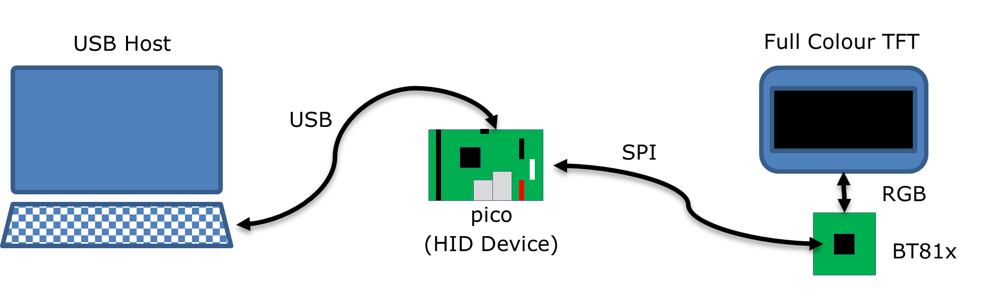

# BRT_AN_012 IDM2040 Series USBD HID Touch Panel

Application Note BRT_AN_012 IDM2040 USBD HID Touch Panel.  
See https://brtchip.com/software-examples/ft9xx-examples/

Demonstrates a USB HID implementing a Virtual Keyboard display on an Bridgetek EVE screen. 
It uses the [BRT_AN_025](https://github.com/Bridgetek/EVE-MCU-BRT_AN_025) EVE library. 

This project requires a BridgeTek IDM2040-7A or IDM2040-43A board and display. It is written to allow easy porting to other MCUs.

## Information

This Application Note describes a virtual keyboard implemented with a Bridgetek IDM2040 touch screen. 
The FT81X and BT81X and later devices are supported. 
In this example, the IDM2040 modules will have a BT817 device and a display of 800 by 480 pixels.

# Introduction

A virtual keyboard is displayed on a touchscreen display and behaves as a standard hardware keyboard when connected via USB to a host computer.

The keyboard can be set to show different keyboard layouts for different regional variations.



**Figure 1 Block Diagram**

The IDM2040 contains a Raspberry Pi RP2040 MCU and is based on a Raspberry Pi pico board. 
The RP2040 and BT817 devices are on the same board with a direct SPI bus connection.

The RP2040 firmware presents a HID keyboard interface to the USB Host computer and a bridge via the SPI bus to the BT817 device. 

The BT817 device controls the TFT display and the touchscreen interface on the display.

## Overview

This document describes the design and implementation of the IDM2040 USBD HID Touch Panel code. The IDM2040 USBD HID Touch Panel allows a user to:
- Implement a virtual keyboard on a touchscreen device.
- Connect the device to a host via USB.
- Interact with the host as if a hardware keyboard was connected.
- Modify the virtual keyboard for different international or regional layouts.

This document is intended to demonstrate the capabilities of the IDM2040 display by emulating USB devices.

## Scope

The virtual keyboard implements a single USB device boot protocol keyboard with a report descriptor to match for a Windows PC. US, UK and standard German keyboard layouts are supported.

There is no specific support for Apple Mac keyboards although most Apple Mac functions can be performed with the keyboard emulated by this application note.

### Features

The application note shows how to implement a USB HID device and interface with an FT81x or BT81x display IC from an RP2040 MCU.
It is modular to allow components to be used by other projects or othe MCUs.

The USB device interface is used to send keyboard scan codes to the host and receive reports to change the status of the Caps Lock, Scroll Lock and Num Lock LEDs on the keyboard.

The RP2040 firmware shows communication with the display IC co-processor, reading touch events and processing these to generate the keyboard scan codes. 
The display has several screens that can be selected with buttons to allow different layout or part of a keyboard to be displayed.

### Enhancement

This application note can be seen as a start for customisation or extension. Some example enhancements could be:
- Support for other country keyboard layouts.
- Add an Apple Mac layout.
- Tailor keyboard layout and function to a particular application. E.g. CAD or Point of Sale.
- Add a multimedia control interface.
- Implementing remote wakeup to allow the keyboard to wake the host.

This USB Device example application should be treated as an example. Full source code is provided allowing users to build and modify if required.

# Project Overview

The main program is responsible for detecting a connection from the RP2040 to the host PC and instantiating as a USB HID class when enumerated by the host. 
It will also call the EVE library to initialise and control the BT817 on the IDM2040.

Source code is divided in folders for functional components. 

## `Sources` Folder

The main part of the application is found in the `Sources` folder. This consists of the following files: 
- The `main.c` file is generally responsible for the RP2040 setup and HID keyboard device code.
- The file `usb_descriptors.c` implements USB device configuration on the RP2040.
- Another file `eve_keyboard.c` controls the EVE keyboard component in the library.

Files in these folders use the `Includes` folder for application specific header files.

## `lib/eve` Folder

This folder holds the API library code which abstracts the BT817 register and processing list writes into C functions. 
It is code copied from the BRT_AN_025 Application Note: https://github.com/Bridgetek/EVE-MCU-BRT_AN_025

Only the `ports/eve_arch_rpi`, `source` and `include` directories need to be copied. 

The macro `PLATFORM_PICO` *MUST* be defined for the proper compilation of this code. 

##	`eve_ui` Folder

In the `eve_ui` folder are several files an routines that simplify the use of EVE:
- The `eve_ui_main.c` file performs general BT817 operations such as initialisation, calibration and detecting touchscreen events (tags). 
It will also generate some simple display lists for "Waiting for Host" and an optional screenshot feature.
- `eve_ui_images.c` contains code for loading JPG images from Program Memory of the RP2040 to the data memory of the BT817.
- `eve_ui_ext_font.c` which has code to load a custom font extension used by this application to display characters not supported by the built-in fonts on the BT817.

##	`eve_ui_keyboard` Folder

The `eve_ui_keyboard.c` file draws a keyboard on the EVE screen by sending display lists to the BT817 via the EVE library. 
It will make display lists for each type of keyboard and populate tag information for the touchscreen controller.

## `Images` Folder

The BT817 can display JPEG images. This folder contains the raw JPEG images which are used in the "eve_ui" library. They are copied to the BT817 by function calls in "eve_ui_images.c".

The files in this folder are loaded into the final application image by creating an assembler file which contains the binary JPG image. 

The process for doing this is handled by a makefile (images.mk) which generates assembler S files for each image in the folder. 
The makefile is run before the main code is compiled and refreshes the source files for the project to include the assembler files. 

### Converting Images in Command Line

There is a Makefile provided to convert the JPG images for the project into an assembler file. 
The JPG data is included in an assembler file and results in the binary data being included in the final binary with a label to access it.

```
make -C Images -f images.mk
```
The output assembler files are placed in the `S` directory.

### Using the Converted Images in the Program

C code must use the correct method for referencing image data stored this way. 

For instance, the file `bridgetek_logo.jpg` will be loaded by the file `bridgetek_logo.S`. 
In that file there is a label for the start of the image data called `img_bridgetek_logo_jpg`. 
The program must convert this label to a form that can be used in a C program:
```
extern const uint8_t __flash__ img_bridgetek_logo_jpg[] asm("img_bridgetek_logo_jpg");
```
This makes a C array pointer which can then be used as the source address in a `memcpy_pm2dat` call. 
Attempts to use the pointer directly with normal variables will not work as the program memory address space is outside the addressable range of normal C pointers.

Images which have been converted with this method will only appear in the final application image if they are referenced in the code. 

## `FontConvertor` Folder

The FT8XX FNT_CVT utility (EVE Font Converter) is used to change a system TTF into a bitmap image which can be used by the BT817. 
The application uses the standard Arial font to make 2 font files: 
ASCII characters from 32 to 127 and several UETF-8 characters for key labels not available through normal ASCII.

The extended characters are used to provide arrow images for key labels and non-ASCII key labels for the standard German keyboard layout.

## `Fonts` Folder

The font files in this folder are the .rawh files produced by the FontConvertor. 
They are loaded into the final application image by creating a C file which contains the binary font data in the form of an array. 

### Converting Fonts in Command Line

There is a Makefile provided to convert the font raw header files for the project into a C source file. 
The font data is included in an C file and results in the binary data being included in the final binary with a label to access it.

```
make -C Fonts -f fonts.mk
```
The output C source files are placed in the `C` directory.

# Compilation

Provision is made to compile from CMake. The BRT_AN_012 source code from the `Bridgetek/EVE-MCU-BRT_AN_012-Example-Pico` repository can be cloned or downloaded from GitHub.

## CMake

From a command line prompt the `cmake` utility will generate and compile the `uf2` file for programming the device. 

The generator "Unix Makefiles" is used for the pico Toolchain. 
When configuring the build environment using CMake the "PICO platform" should be reported as `RP2040` and the "PICO target board" should be reported as `pico`. 
Also, it is useful to generate build files in an intermediate directory.
A good command line to choose to generate build files for CMake is:

`cmake -G "Unix Makefiles" -B build -S .` 

Then the binary can be compiled with:

`cmake --build build`

Optional parameters for the build are as described in the pico/RP2040 documentation.

# Changing the Application Software

The application software provided can be altered and changed if required.

With each software change, the project should be rebuilt and reprogrammed into the IDM2040. 

Windows will not reload a driver for a device with the same VID/PID and serial number but a different USB Class. If there are driver problems then remove the "USB Composite Device" detected for the application in Windows Device Manager then unplug and replug the device.

# Software Implementation

The application note implements a USB HID class device which can be accessed by a USB host with appropriate driver software. 
The USB device code is implemented in `main.c` and USB HID class specific code is in `usb_descriptors.c`.
Control of the screen is performed by `eve_keyboard.c`. 
This includes all the screen layout except the keyboard area which is drawn in the `eve_ui_keyboard` library.
All virtual keyboard drawing will use aspects of the `eve_ui` library which in-turn invokes the EVE library for low-level control of the BT817 device.

Keypress events detected on the virtual keyboard will generate "tags" which uniquely represent one keyboard action. 
These tags indicate that a key has been pressed, such as a letter or number key. 
Each tag received by the `eve_ui_keyboard` library will be converted into a HID report in `main.c` and sent to the host via USB.

## USB Implementation Overview

The USB device implements a composite device consisting of 2 HID interfaces. 
The endpoints on these interfaces will produce one of 3 different report descriptor types when a key is pressed. 

The first interface is a "Boot Report" type interface with a single endpoint producing a single report to the host; 
the second interface can either produce Application Reports (Power Down, Suspend etc.) or Consumer Control Reports (Media Controls etc.).


**Figure 5 USB Interface Diagram**

The application will decode the type of the key pressed on the virtual keypad to one of the 3 report types by identifying the key"s tag in a lookup table. 
The lookup table can be modified or extended to suit the application.

## USB Code Overview

The logical model of the USB device software, as coded in `main.c`, is as follows:


**Figure 6 USB Device Software Flow**

Once the USB device is detected to be connected to the USB host the device driver is initialised. 
Although the project is designed to work bus-powered, the initial check is required to allow a bus speed test to be made and appropriate endpoints to be created.

The USB device connection is found with an API call made to USBD_connect function and the speed determined with an API call to USBD_get_bus_speed.

Once initialised, the software will continue to check for a proper connection to the host. 
If this drops then it will return to the state of waiting for a connection. 
If the device is not bus-powered then it will re-detect the host and bus speed.

The API call to USB_process will update the USB device state and handle any control endpoint requests from the host. 
When starting the device this will primarily be enumeration requests and result in the USB device state moving from ATTACHED to POWERED, then to DEFAULT and then to ADDRESSED. 
At this point the USB host can address non-control endpoints on the device. Finally, once the device driver on the host completes initialisation it will move to CONFIGURED state. 
These states are defined, explained and discussed in the USB Specification.

The USB device in this code waits for the CONFIGURED state to be reached before checking for reports to send to the host. 

### USB Descriptors

All descriptors which are used in responses to standard USB SETUP requests are placed in `main.c`.
- The Device Descriptor
- 2 Configuration Descriptors, High-speed and Full-speed
- A Device Qualifier Descriptor
- String Descriptors
- 2 HID Report Descriptors

A standard request USB Other Speed Configuration Descriptor is generated using the data from the Configuration Descriptors. 

### USB Control Endpoint Requests

USB requests are handled by the USB device driver when the USBD_process API call is made. 
This will invoke callback functions in main.c to process standard USB requests for descriptors and state changing, but will also receive Class and Vendor requests. 

Class requests are received in the class_req_cb function and are decoded to call the class_req_interface_hid function if this is required. 
This class-specific function deals with interface requests to the HID device. 
It will process the Get/Set Idle, Get /Set Protocol and Get/Set Report requests. 
These handlers may call the keyboard interface code to retrieve or set states.

## Keyboard Code Overview

The keyboard interface code keeps an internal state of the HID class device, treating the 2 HID class interfaces separately. 

The state of a HID interface is affected by the SetIdle request and the SetProtocol request. 
The enable state of the Boot Report keyboard (whether it transmits data to the host on its Interrupt IN endpoint) is set by the reception of a suitable SetIdle request. 
The generic HID interface is enabled once the device reaches the CONFIGURED state.

The keyboard function keyboard_loop is polled and this will receive tags from the virtual keyboard, translate these to reports and return a status indicating whether data needs to be transmitted to the host.

### Generating Reports

When a tag is received from the virtual keyboard it will be translated into a HID report by the keyboard code in `keyboard.c`. 
Depending on the tag, the HID report will be one of the three defined types. 

The Generic HID interface on which consumer control and system control reports are sent requires a report ID to identify the type of the report. 
This is used by the host to match the report up to a report descriptor. 
The Boot Report USB interface has a single report defined and therefore does not require a report ID.

Consumer control and system control reports are normally on-off controls (OOCs) or one-shot controls (OSCs) as defined in the Universal Serial Bus HID Usage Tables. 
Modification of the report generation code will be required for other types of Usage Types.

#### Boot Reports

Boot reports contain several flags for "modifier" keys (shift, control, alt and GUI) and one-byte scancodes which identify any "normal" key pressed. 
If no normal key is pressed then the scancode will be zero. When any key is released then a report is sent with either or both the flag and scancode cleared. 

#### Consumer Control Reports

The consumer control report will send a two-byte scancode with the appropriate function for the tag. 

The report ID for consumer controls is 2.
 
#### System Control Reports

A system control report allows for one (or more) of the power down, sleep or wake flags to be set.

The report ID for system controls is 1.

## Virtual Keyboard Code Overview

The BT817 device relies on a method called a "display list" to determine what is shown on the screen. 
This means that a new display list is generated only when a display change is required. 

Each virtual "key" on the keyboard is assigned a unique tag. 
The function `eve_ui_keyboard_loop` in `eve_ui_keyboard.c` source code file detects a touchscreen press and returns the tag of the button.
Some buttons are reserved within the `eve_ui_keyboard` library to enable switching between keyboard, keypad, media and special screens. 

The `eve_ui_keyboard` library is designed to isolate the screen drawing and management from the features of the USB keyboard device. 
This will allow it to be used as data entry method for other applications. 
Only decoding of `eve_ui_keyboard` defined tags to actions (or characters) is needed to add text entry. 

The screen header is specifically drawn in `eve_keyboard.c` to allow for the library to be expanded with additional methods.

## Optional Features

### Special Screens

A special screen is demonstrated which has a key layout specific to an application. This screen is selected using the orange "Z" on the header bar.
 
# Using the Virtual Keyboard

## Required Hardware

The application note is intended to be used on an IDM2040-7A or IDM2040-43A EVE development module. 
The application note is written to work on an 800 by 600 display. 
Changes to the EVE module settings can be made in the `EVE_config.h` file in the `Includes` folder of the source code.

 

**IDM2040-7A Module**

A standalone RP2040 MCU may alternatively be connected to an EVE development module via an SPI bus. 
For a standard pico module SPI bus 1 must be used rather than SPI bus 0 which is used on the IDM2040 modules.
This is changed in the `EVE_MCU-RP2040.c` file in the EVE library.

## Use of Application Note Software

The virtual keyboard will wait until it is connected to a host. The IDM2040 display will indicate this with the Bridgetek logo and the caption "Waiting for host...".

Once the host is connected then it will display the virtual keyboard.

 

**Figure 8 Virtual Keyboard Screen**

The settings screen, is accessed from the "Settings" button allowing the choice of UK, US and German keyboard layouts. 
Pressing "Settings" in the upper left hand corner will display an alphanumeric keyboard section of the virtual keyboard.

Pressing the "KeyPad" button will show the control and keypad area of a standard keyboard. 
To return to the main keyboard press the "Keyboard" button again.

 

**Figure 9 Virtual KeyPad Screen**

Pressing the "Z" button will show the special application screen. 
There is no functionality in the special application screen.
The keyboard or keypad can still be accessed with appropriate buttons.

##	Keyboard Layouts

There are 3 different layouts for keys supported in this application:

The US and UK layouts are QWERTY layouts where the key positions change slightly; 
the German layout is QWERTZ, however the layout is the same as the UK layout. 

For each keyboard to work the host needs to have its keyboard locale set to the keyboard layout correctly to allow the scan codes to match the key labels.

# Appendix C " Revision History

Document Title: BRT_AN_012 IDM2040 USBD HID Touch Panel

Product Page: https://brtchip.com/product/idm2040-7a/ https://brtchip.com/product/idm2040-43a/

| Revision | Changes | Date |
| ------------- |:-------------:| -----:|
| 1.0 | Initial Release | 03/07/2017 | 
| 1.1 | Fixed the Product Page broken link under Section Appendix C " Revision History. | 31/10/2017 | 
| 1.2 | Improvements to code and to the scope and coverage of the document. | 20/08/2| 1.3 | This release will support FT9xx Toolchain version V2.5.0 and later. Older toolchain versions are not supported due to an API change in the usbd.c library file. | 05/03/2019 |
| 1.4 | Rewrite to use released version of [BRT_AN_025](https://github.com/Bridgetek/EVE-MCU-BRT_AN_025) | 11/01/2023 |
| 1.5 | Adapted for IDM2040-7A (pico) example. | 16/01/2023 |


